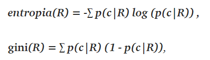

# Árvore de decisão
## Conceito (O que é? Pra que serve?)

São um método de classificação e regressão muito utilizado pela sua facilidade de implementação, e por serem conceitualmente simples, porém ainda sim, muito poderosas.

Basicamente todos nós já utilizamos uma arvore de decisão, principalmente se desenhamos algum tipo de fluxograma (sem loop) conforme mostra a imagem abaixo.


Estes fluxogramas são bastante usados para facilitar a visualização das informações, e das condições que levam a tomar uma decisão ou outra. E com a mesma simplicidade e facilidade, podemos implementar uma árvore de decisão.

Basicamente sua estrutura consiste em nós e folhas. Um nó pode se ligar a um outro nó, ou a uma folha que são onde uma ramificação da arvore termina. Existe um nó principal, chamado nó raiz, que representa o início da árvore, ou seja, o maior nível hierarquico da árvore.

Dito isto, a árvore de decisão é nada mais que uma árvore onde os nós representam as regras de cada nó, e as folhas representam a decisão a ser tomada.

Mas basicamente a árvore de decisão por si só, não pode ser considerada machine learning, pois podemos criar ela manualmente. Para ser considerada uma técnica de machine learning, é preciso que esta aprenda automaticamente a partir de um conjunto de dados, criando as regras dos nós e as decisões nas folhas.

## Classes de Problemas com melhores resultados

Como dito, este algorítmo serve tanto para resolver problemas de classificação e de regressão. Sua aplicabilidade é variada, extendendo a qualquer tipo de problema.

## Definição Teórica e Modelagem Matemática

Basicamente a ideia geral é particinar os dados em dados menores (sub-regiões). As sub-regiões continuarão sendo divididas recursivamente até encontrar uma região pura, ou seja, que todos os dados pertencem a uma classe apenas, ou até uma condição de parada ser alcançada, que pode ser a profundidade da arvore, ou o número de folhas, ou alguma outra que fizer sentido para o problema.

Para gerar estas sub-regiões, existem vários algorítmos, sendo eles `CART`, `ID3`, e `C4.5`. Todos eles possuem o mesmo intuito, e funcionam de forma semelhante.

Para encontrar o melhor ponto de corte, devemos considerar algumas medidas de impureza, como Gini Index, Entropia ou taxa de erro. Para encontrar um ponto de corte ótimo, pode demorar muito e acaba sendo inviável para algumas classes de problemas. Portanto focamos em encontrar o ótimo local.

Para encontrar este ótimo local, testamos as possibilidades de corte com todos os valores possíveis, e utilizamos aquele que mais nos dê maior ganho de informação, que pode ser calculado da seguinte forma:

`InfoGain(R, R_e, R_d) = H(R) - (|R_e| * H(R_e) + |R_d| * H(R_d)) / |R|`

Onde H é a impureza da região, R é a região atual, R_e é a sub-região da esquerda, R_d é a sub-região da direito e \|...\| é a quantidade de exemplos da região.

Os critérios de impureza mais comuns são Entropia e o índice de Gini.



Onde p(c\|R) é a probabilidade de um ponto da região R pertencer a classe c, que é estimada pela razão entre quantidade de pontos em R na classe c, e total de pontos em R.

## Vantagens e Desvantagens (limitações)

Vantagens:

- Conceitualmente simples
- Poderosas
- Facilidade de interpretar
- Não necessita de normalização dos dados para sua utilização
  
Desvantagens:

- Caso a profundidade seja muito grande, pode causar overfitting, ou seja, pode ficar viciada nos dados de treinamento, performando mal nos dados desconhecidos.
- É instável, pois uma pequena variação nos dados pode resultar em árvores completamente distintas.
- O algorítmo não garante a construção da melhor estrutura para os dados de treino.

## Exemplo de uma aplicação em Python

```python
# CART on the Bank Note dataset
from random import seed
from random import randrange
from csv import reader


# Load a CSV file
def load_csv(filename):
    file = open(filename, "rt")
    lines = reader(file)
    dataset = list(lines)
    return dataset


# Convert string column to float
def str_column_to_float(dataset, column):
    for row in dataset:
        row[column] = float(row[column].strip())


# Split a dataset into k folds
def cross_validation_split(dataset, n_folds):
    dataset_split = list()
    dataset_copy = list(dataset)
    fold_size = int(len(dataset) / n_folds)
    for i in range(n_folds):
        fold = list()
        while len(fold) < fold_size:
            index = randrange(len(dataset_copy))
            fold.append(dataset_copy.pop(index))
        dataset_split.append(fold)
    return dataset_split


# Calculate accuracy percentage
def accuracy_metric(actual, predicted):
    correct = 0
    for i in range(len(actual)):
        if actual[i] == predicted[i]:
            correct += 1
    return correct / float(len(actual)) * 100.0


# Evaluate an algorithm using a cross validation split
def evaluate_algorithm(dataset, algorithm, n_folds, *args):
    folds = cross_validation_split(dataset, n_folds)
    scores = list()
    for fold in folds:
        train_set = list(folds)
        train_set.remove(fold)
        train_set = sum(train_set, [])
        test_set = list()
        for row in fold:
            row_copy = list(row)
            test_set.append(row_copy)
            row_copy[-1] = None
        predicted = algorithm(train_set, test_set, *args)
        actual = [row[-1] for row in fold]
        accuracy = accuracy_metric(actual, predicted)
        scores.append(accuracy)
    return scores


# Split a dataset based on an attribute and an attribute value
def test_split(index, value, dataset):
    left, right = list(), list()
    for row in dataset:
        if row[index] < value:
            left.append(row)
        else:
            right.append(row)
    return left, right


# Calculate the Gini index for a split dataset
def gini_index(groups, classes):
    # count all samples at split point
    n_instances = float(sum([len(group) for group in groups]))
    # sum weighted Gini index for each group
    gini = 0.0
    for group in groups:
        size = float(len(group))
        # avoid divide by zero
        if size == 0:
            continue
        score = 0.0
        # score the group based on the score for each class
        for class_val in classes:
            p = [row[-1] for row in group].count(class_val) / size
            score += p * p
        # weight the group score by its relative size
        gini += (1.0 - score) * (size / n_instances)
    return gini


# Select the best split point for a dataset
def get_split(dataset):
    class_values = list(set(row[-1] for row in dataset))
    b_index, b_value, b_score, b_groups = 999, 999, 999, None
    for index in range(len(dataset[0])-1):
        for row in dataset:
            groups = test_split(index, row[index], dataset)
            gini = gini_index(groups, class_values)
            if gini < b_score:
                b_index, b_value, b_score, b_groups = index, row[index], gini, groups
    return {'index': b_index, 'value': b_value, 'groups': b_groups}


# Create a terminal node value
def to_terminal(group):
    outcomes = [row[-1] for row in group]
    return max(set(outcomes), key=outcomes.count)


# Create child splits for a node or make terminal
def split(node, max_depth, min_size, depth):
    left, right = node['groups']
    del(node['groups'])
    # check for a no split
    if not left or not right:
        node['left'] = node['right'] = to_terminal(left + right)
        return
    # check for max depth
    if depth >= max_depth:
        node['left'], node['right'] = to_terminal(left), to_terminal(right)
        return
    # process left child
    if len(left) <= min_size:
        node['left'] = to_terminal(left)
    else:
        node['left'] = get_split(left)
        split(node['left'], max_depth, min_size, depth+1)
    # process right child
    if len(right) <= min_size:
        node['right'] = to_terminal(right)
    else:
        node['right'] = get_split(right)
        split(node['right'], max_depth, min_size, depth+1)


# Build a decision tree
def build_tree(train, max_depth, min_size):
    root = get_split(train)
    split(root, max_depth, min_size, 1)
    return root


# Make a prediction with a decision tree
def predict(node, row):
    if row[node['index']] < node['value']:
        if isinstance(node['left'], dict):
            return predict(node['left'], row)
        else:
            return node['left']
    else:
        if isinstance(node['right'], dict):
            return predict(node['right'], row)
        else:
            return node['right']


# Classification and Regression Tree Algorithm
def decision_tree(train, test, max_depth, min_size):
    tree = build_tree(train, max_depth, min_size)
    predictions = list()
    for row in test:
        prediction = predict(tree, row)
        predictions.append(prediction)
    return(predictions)


# Test CART on Bank Note dataset
seed(1)
# load and prepare data
filename = './database-decision-tree/data_banknote_authentication.csv'
dataset = load_csv(filename)
# convert string attributes to integers
for i in range(len(dataset[0])):
    str_column_to_float(dataset, i)

# evaluate algorithm
n_folds = 5
max_depth = 5
min_size = 10
scores = evaluate_algorithm(dataset, decision_tree,
                            n_folds, max_depth, min_size)
print(f'Scores: {scores}')
print(f'Mean Accuracy: {sum(scores)/float(len(scores)):.3f}%')
```

# Comitê de árvore de decisão (Ensembles of decisions tree)

## Conceito

Para mitigar alguns problemas relacionados a construção de uma árvore de decisão simples, foi criada a técnica de Comitê de árvore de decisão, ou ensembles of decisions tree.

Os comitês são métodos que combinam várias árvores para produzir uma predição melhor. Ou seja, utiliza das vantagens de uma árvore de decisão, e ao mesmo tempo tenta mitigar as desvantagens dela quando usada sozinha.

## Classes de Problemas com melhores resultados

Como no caso da árvore de decisão, é usado tanto para classificação quanto para regressão.

## Definição Teórica e Modelagem Matemática

Uma das técnicas é chamada **Bagging**, que é usada quando o intuito é reduzir a variação da árvore de decisão. A ideia principal é criar subconjunto de dados de treinamento aleatoriamente. Assim cada subconjunto de dado é usado para treinar sua propria arvore de decisão. O resultado são várias árvores, onde na predição o resultado de todas as árvores são usadas, tornando o resultado mais robusto do que uma única árvore.

O [random forest](./Random-Forest.md) é um algorítmo extendido do bagging.

Outra técnica é a de **Boosting**. Nesta técnica, as árvores são criadas sequencialmente, e a cada sequencia o objetivo é resolver o erro da árvore anterior. 

Quando uma entrada é classificada incorretamente, seu peso é aumentado para que a próxima predição seja classificada corretamente. Após a execução de todo os dados de treinamento e sequências, a árvore que antes tinha um vícios, ou não predizia bem, passa a ter um desempenho melhor.

Ainda pode ser usado a técnica **Gradient Boosting**, que é uma extensão do método de boosting. Esta técnica usa gradiente descendente para minimizar o erro.

## Vantagens e Desvantagens (limitações)

Vantagens:

- Resolve problemas das árvores de decisão quando usadas sozinhas.
- Lida com parâmetros faltantes, e mesmo assim gera um bom resultado
- Lida bem com várias dimensões de parâmetros

Desvantagens:

- No caso do Bagging e Random Forest, a aplicação em problemas de regressão gera um resultado um pouco pior.
- No caso do boosting, ainda é propenso ao overfitting.

## Exemplo de uma aplicação em Python

```python
from __future__ import division, print_function
# from mlfromscratch.supervised_learning import GradientBoostingClassifier
# from mlfromscratch.utils import Plot
# from mlfromscratch.deep_learning.loss_functions import CrossEntropy
# from mlfromscratch.utils import train_test_split, accuracy_score
from sklearn import datasets
import numpy as np

# Import helper functions
# from mlfromscratch.utils import train_test_split, standardize, to_categorical
# from mlfromscratch.utils import mean_squared_error, accuracy_score
# from mlfromscratch.deep_learning.loss_functions import SquareLoss, CrossEntropy
# from mlfromscratch.supervised_learning.decision_tree import RegressionTree
# from mlfromscratch.utils.misc import bar_widgets


def to_categorical(x, n_col=None):
    """ One-hot encoding of nominal values """
    if not n_col:
        n_col = np.amax(x) + 1
    one_hot = np.zeros((x.shape[0], n_col))
    one_hot[np.arange(x.shape[0]), x] = 1
    return one_hot


def divide_on_feature(X, feature_i, threshold):
    """ Divide dataset based on if sample value on feature index is larger than
        the given threshold """
    split_func = None
    if isinstance(threshold, int) or isinstance(threshold, float):
        def split_func(sample): return sample[feature_i] >= threshold
    else:
        def split_func(sample): return sample[feature_i] == threshold

    X_1 = np.array([sample for sample in X if split_func(sample)])
    X_2 = np.array([sample for sample in X if not split_func(sample)])

    return np.array([X_1, X_2])


def calculate_variance(X):
    """ Return the variance of the features in dataset X """
    mean = np.ones(np.shape(X)) * X.mean(0)
    n_samples = np.shape(X)[0]
    variance = (1 / n_samples) * np.diag((X - mean).T.dot(X - mean))

    return variance


class DecisionNode():
    """Class that represents a decision node or leaf in the decision tree

    Parameters:
    -----------
    feature_i: int
        Feature index which we want to use as the threshold measure.
    threshold: float
        The value that we will compare feature values at feature_i against to
        determine the prediction.
    value: float
        The class prediction if classification tree, or float value if regression tree.
    true_branch: DecisionNode
        Next decision node for samples where features value met the threshold.
    false_branch: DecisionNode
        Next decision node for samples where features value did not meet the threshold.
    """

    def __init__(self, feature_i=None, threshold=None,
                 value=None, true_branch=None, false_branch=None):
        self.feature_i = feature_i          # Index for the feature that is tested
        self.threshold = threshold          # Threshold value for feature
        self.value = value                  # Value if the node is a leaf in the tree
        self.true_branch = true_branch      # 'Left' subtree
        self.false_branch = false_branch    # 'Right' subtree


class DecisionTree(object):
    """Super class of RegressionTree and ClassificationTree.

    Parameters:
    -----------
    min_samples_split: int
        The minimum number of samples needed to make a split when building a tree.
    min_impurity: float
        The minimum impurity required to split the tree further.
    max_depth: int
        The maximum depth of a tree.
    loss: function
        Loss function that is used for Gradient Boosting models to calculate impurity.
    """

    def __init__(self, min_samples_split=2, min_impurity=1e-7,
                 max_depth=float("inf"), loss=None):
        self.root = None  # Root node in dec. tree
        # Minimum n of samples to justify split
        self.min_samples_split = min_samples_split
        # The minimum impurity to justify split
        self.min_impurity = min_impurity
        # The maximum depth to grow the tree to
        self.max_depth = max_depth
        # Function to calculate impurity (classif.=>info gain, regr=>variance reduct.)
        self._impurity_calculation = None
        # Function to determine prediction of y at leaf
        self._leaf_value_calculation = None
        # If y is one-hot encoded (multi-dim) or not (one-dim)
        self.one_dim = None
        # If Gradient Boost
        self.loss = loss

    def fit(self, X, y, loss=None):
        """ Build decision tree """
        self.one_dim = len(np.shape(y)) == 1
        self.root = self._build_tree(X, y)
        self.loss = None

    def _build_tree(self, X, y, current_depth=0):
        """ Recursive method which builds out the decision tree and splits X and respective y
        on the feature of X which (based on impurity) best separates the data"""

        largest_impurity = 0
        best_criteria = None    # Feature index and threshold
        best_sets = None        # Subsets of the data

        # Check if expansion of y is needed
        if len(np.shape(y)) == 1:
            y = np.expand_dims(y, axis=1)

        # Add y as last column of X
        Xy = np.concatenate((X, y), axis=1)

        n_samples, n_features = np.shape(X)

        if n_samples >= self.min_samples_split and current_depth <= self.max_depth:
            # Calculate the impurity for each feature
            for feature_i in range(n_features):
                # All values of feature_i
                feature_values = np.expand_dims(X[:, feature_i], axis=1)
                unique_values = np.unique(feature_values)

                # Iterate through all unique values of feature column i and
                # calculate the impurity
                for threshold in unique_values:
                    # Divide X and y depending on if the feature value of X at index feature_i
                    # meets the threshold
                    Xy1, Xy2 = divide_on_feature(Xy, feature_i, threshold)

                    if len(Xy1) > 0 and len(Xy2) > 0:
                        # Select the y-values of the two sets
                        y1 = Xy1[:, n_features:]
                        y2 = Xy2[:, n_features:]

                        # Calculate impurity
                        impurity = self._impurity_calculation(y, y1, y2)

                        # If this threshold resulted in a higher information gain than previously
                        # recorded save the threshold value and the feature
                        # index
                        if impurity > largest_impurity:
                            largest_impurity = impurity
                            best_criteria = {
                                "feature_i": feature_i, "threshold": threshold}
                            best_sets = {
                                # X of left subtree
                                "leftX": Xy1[:, :n_features],
                                # y of left subtree
                                "lefty": Xy1[:, n_features:],
                                # X of right subtree
                                "rightX": Xy2[:, :n_features],
                                # y of right subtree
                                "righty": Xy2[:, n_features:]
                            }

        if largest_impurity > self.min_impurity:
            # Build subtrees for the right and left branches
            true_branch = self._build_tree(
                best_sets["leftX"], best_sets["lefty"], current_depth + 1)
            false_branch = self._build_tree(
                best_sets["rightX"], best_sets["righty"], current_depth + 1)
            return DecisionNode(feature_i=best_criteria["feature_i"], threshold=best_criteria[
                                "threshold"], true_branch=true_branch, false_branch=false_branch)

        # We're at leaf => determine value
        leaf_value = self._leaf_value_calculation(y)

        return DecisionNode(value=leaf_value)

    def predict_value(self, x, tree=None):
        """ Do a recursive search down the tree and make a prediction of the data sample by the
            value of the leaf that we end up at """

        if tree is None:
            tree = self.root

        # If we have a value (i.e we're at a leaf) => return value as the prediction
        if tree.value is not None:
            return tree.value

        # Choose the feature that we will test
        feature_value = x[tree.feature_i]

        # Determine if we will follow left or right branch
        branch = tree.false_branch
        if isinstance(feature_value, int) or isinstance(feature_value, float):
            if feature_value >= tree.threshold:
                branch = tree.true_branch
        elif feature_value == tree.threshold:
            branch = tree.true_branch

        # Test subtree
        return self.predict_value(x, branch)

    def predict(self, X):
        """ Classify samples one by one and return the set of labels """
        y_pred = [self.predict_value(sample) for sample in X]
        return y_pred

    def print_tree(self, tree=None, indent=" "):
        """ Recursively print the decision tree """
        if not tree:
            tree = self.root

        # If we're at leaf => print the label
        if tree.value is not None:
            print(tree.value)
        # Go deeper down the tree
        else:
            # Print test
            print("%s:%s? " % (tree.feature_i, tree.threshold))
            # Print the true scenario
            print("%sT->" % (indent), end="")
            self.print_tree(tree.true_branch, indent + indent)
            # Print the false scenario
            print("%sF->" % (indent), end="")
            self.print_tree(tree.false_branch, indent + indent)


class RegressionTree(DecisionTree):
    def _calculate_variance_reduction(self, y, y1, y2):
        var_tot = calculate_variance(y)
        var_1 = calculate_variance(y1)
        var_2 = calculate_variance(y2)
        frac_1 = len(y1) / len(y)
        frac_2 = len(y2) / len(y)

        # Calculate the variance reduction
        variance_reduction = var_tot - (frac_1 * var_1 + frac_2 * var_2)

        return sum(variance_reduction)

    def _mean_of_y(self, y):
        value = np.mean(y, axis=0)
        return value if len(value) > 1 else value[0]

    def fit(self, X, y):
        self._impurity_calculation = self._calculate_variance_reduction
        self._leaf_value_calculation = self._mean_of_y
        super(RegressionTree, self).fit(X, y)


class Loss(object):
    def loss(self, y_true, y_pred):
        return NotImplementedError()

    def gradient(self, y, y_pred):
        raise NotImplementedError()

    def acc(self, y, y_pred):
        return 0


class SquareLoss(Loss):
    def __init__(self): pass

    def loss(self, y, y_pred):
        return 0.5 * np.power((y - y_pred), 2)

    def gradient(self, y, y_pred):
        return -(y - y_pred)


class CrossEntropy(Loss):
    def __init__(self): pass

    def loss(self, y, p):
        # Avoid division by zero
        p = np.clip(p, 1e-15, 1 - 1e-15)
        return - y * np.log(p) - (1 - y) * np.log(1 - p)

    def acc(self, y, p):
        return accuracy_score(np.argmax(y, axis=1), np.argmax(p, axis=1))

    def gradient(self, y, p):
        # Avoid division by zero
        p = np.clip(p, 1e-15, 1 - 1e-15)
        return - (y / p) + (1 - y) / (1 - p)


class GradientBoosting(object):
    """Super class of GradientBoostingClassifier and GradientBoostinRegressor. 
    Uses a collection of regression trees that trains on predicting the gradient
    of the loss function. 
    Parameters:
    -----------
    n_estimators: int
        The number of classification trees that are used.
    learning_rate: float
        The step length that will be taken when following the negative gradient during
        training.
    min_samples_split: int
        The minimum number of samples needed to make a split when building a tree.
    min_impurity: float
        The minimum impurity required to split the tree further. 
    max_depth: int
        The maximum depth of a tree.
    regression: boolean
        True or false depending on if we're doing regression or classification.
    """

    def __init__(self, n_estimators, learning_rate, min_samples_split,
                 min_impurity, max_depth, regression):
        self.n_estimators = n_estimators
        self.learning_rate = learning_rate
        self.min_samples_split = min_samples_split
        self.min_impurity = min_impurity
        self.max_depth = max_depth
        self.regression = regression

        # Square loss for regression
        # Log loss for classification
        self.loss = SquareLoss()
        if not self.regression:
            self.loss = CrossEntropy()

        # Initialize regression trees
        self.trees = []
        for _ in range(n_estimators):
            tree = RegressionTree(
                min_samples_split=self.min_samples_split,
                min_impurity=min_impurity,
                max_depth=self.max_depth)
            self.trees.append(tree)

    def fit(self, X, y):
        y_pred = np.full(np.shape(y), np.mean(y, axis=0))
        for i in range(self.n_estimators):
            gradient = self.loss.gradient(y, y_pred)
            self.trees[i].fit(X, gradient)
            update = self.trees[i].predict(X)
            # Update y prediction
            y_pred -= np.multiply(self.learning_rate, update)

    def predict(self, X):
        y_pred = np.array([])
        # Make predictions
        for tree in self.trees:
            update = tree.predict(X)
            update = np.multiply(self.learning_rate, update)
            y_pred = -update if not y_pred.any() else y_pred - update

        if not self.regression:
            # Turn into probability distribution
            y_pred = np.exp(
                y_pred) / np.expand_dims(np.sum(np.exp(y_pred), axis=1), axis=1)
            # Set label to the value that maximizes probability
            y_pred = np.argmax(y_pred, axis=1)
        return y_pred


class GradientBoostingClassifier(GradientBoosting):
    def __init__(self, n_estimators=200, learning_rate=.5, min_samples_split=2,
                 min_info_gain=1e-7, max_depth=2, debug=False):
        super(GradientBoostingClassifier, self).__init__(n_estimators=n_estimators,
                                                         learning_rate=learning_rate,
                                                         min_samples_split=min_samples_split,
                                                         min_impurity=min_info_gain,
                                                         max_depth=max_depth,
                                                         regression=False)

    def fit(self, X, y):
        y = to_categorical(y)
        super(GradientBoostingClassifier, self).fit(X, y)


# Import helper functions
def accuracy_score(y_true, y_pred):
    """ Compare y_true to y_pred and return the accuracy """
    accuracy = np.sum(y_true == y_pred, axis=0) / len(y_true)
    return accuracy


def shuffle_data(X, y, seed=None):
    """ Random shuffle of the samples in X and y """
    if seed:
        np.random.seed(seed)
    idx = np.arange(X.shape[0])
    np.random.shuffle(idx)
    return X[idx], y[idx]


def train_test_split(X, y, test_size=0.5, shuffle=True, seed=None):
    """ Split the data into train and test sets """
    if shuffle:
        X, y = shuffle_data(X, y, seed)
    # Split the training data from test data in the ratio specified in
    # test_size
    split_i = len(y) - int(len(y) // (1 / test_size))
    X_train, X_test = X[:split_i], X[split_i:]
    y_train, y_test = y[:split_i], y[split_i:]

    return X_train, X_test, y_train, y_test


def main():

    print("-- Gradient Boosting Classification --")

    data = datasets.load_iris()
    X = data.data
    y = data.target

    X_train, X_test, y_train, y_test = train_test_split(X, y, test_size=0.4)

    clf = GradientBoostingClassifier()
    clf.fit(X_train, y_train)
    y_pred = clf.predict(X_test)

    accuracy = accuracy_score(y_test, y_pred)

    print("Accuracy:", accuracy)

    # Plot().plot_in_2d(X_test, y_pred,
    #                   title="Gradient Boosting",
    #                   accuracy=accuracy,
    #                   legend_labels=data.target_names)


if __name__ == "__main__":
    main()
```