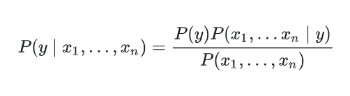
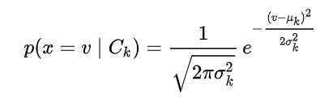
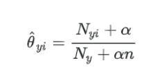
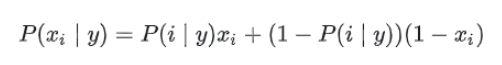

# Conceito (O que é? Pra que serve?)

Este algorítmo é um algorítmo probabilístico, que é bastante usado para fazer classificações, sendo um dos melhores quando o problema for classificar texto ou algo do gênero. Como envolve uma modelagem matemática simples, ele é rápido, possuindo um desempenho relativamente maior que os demais classificadores. Devido ao alto desempenho, geralmente é usado até em aplicações que necessitam de informações em tempo real.

Também é um algorítmo relativamente rápido no seu treinado, necessitando de poucos testes para concluir as classificações com uma boa acurácia.

O algorítmo recebe este nome de `naive(ingênuo)` pois ele desconsidera qualquer correlação entre as variáveis. Desta forma, devemos saber que para problemas que as variáveis possui correção entre si, este algorítmo não terá uma boa predição.

# Classes de Problemas com melhores resultados

Este algorítmo resolve problemas de classificação. Atualmente é bastante usado para identificar se um e-mail é spam ou sobre qual assunto um texto se refere, com base na frequência que as palavras são usadas.

# Definição Teórica e Modelagem Matemática

Este algorítmo probabilístico foi baseado no "Teorema de Bayes", que foi criado por Thomas Bayes pra tentar provar a existência de Deus.

O teorema se dá pela formula abaixo considerando n features:



O classificador de Bayes se da pela fórmula abaixo:


Portanto, o algoritmo considera a probabilidade de um determinado evento y acontecer de acordo com a maior combinação da prbabilidade do evento pela probabilidade das demais features.

Para implementar o modelo, temos 3 algorítmos naiva bayes mais usados. Os algorítmos que variam são para calcular a probabilidade de P(xi | y), e deve ser escolhido de modo que as features de cada observação estejam de acordo com o tipo de distribuição de probabilidade especificada pelo algorítmo.

São eles:

## Gaussian Naive Bayes

Usado para dados contínuos, distribuídos de acordo com uma curva gaussiana.



Sendo `uk` a média e `ok` o desvio padrão dos valores `x` associados a classe `Ck`.

## Multinomial Naive Bayes

Usado para dados com distribuição multinomial, que é a generalização da distribuição binomial. 

O cálculo de `Oyi = P(xi | y)` é estimado pela fórmula:



Onde `Nyi` é o número de vezes que a feature xi aparece no conjunto de treinamento, `Ny` é o número de observações com a classe `y`, `n` é o número de features e `alfa` é a constante que contabiliza os recursos que não estão presentes nas amostras de aprendizado e impede que haja probabilidade igual a 0.

## Bernoulli Naive Bayes

Este se baseia numa base de dados de acordo com a Distribuição Multivariada de Bernoulli, que é composta por diversas features, as quais são valores binários.

Mesmo que não seja, BernoulliNB() irá tranformá-la em uma feature composta por valores binários.

Neste modelo, P(xi | y) é dado por:



Onde P(i | y) é o parâmetro p da distribuição de Bernoulli. Assim, `P(i | y) = p` se y é verdadeiro e `P(i | y) = 1 - p` se y é falso.

# Vantagens e Desvantagens (limitações)

Vantagens:
- É um algorítmo performático comparado a outros
- Necessita poucas entradas para treinamento para chegar numa acurácia boa.
- Utiliza conceitos de probabilidade
Desvantagens:
- Não considera a correlação das variáveis
- Apenas resolve problemas de classificação

# Exemplo de uma aplicação em Python

No modelo foi usado o algorítmo Gaussian Naive Bayes.

```python
from csv import reader
from random import seed
from random import randrange
from math import sqrt
from math import exp
from math import pi

# Load a CSV file
def load_csv(filename):
	dataset = list()
	with open(filename, 'r') as file:
		csv_reader = reader(file)
		for row in csv_reader:
			if not row:
				continue
			dataset.append(row)
	return dataset

# Convert string column to float
def str_column_to_float(dataset, column):
	for row in dataset:
		row[column] = float(row[column].strip())

# Convert string column to integer
def str_column_to_int(dataset, column):
	class_values = [row[column] for row in dataset]
	unique = set(class_values)
	lookup = dict()
	for i, value in enumerate(unique):
		lookup[value] = i
		print(f'[{value}] => {i}')
	for row in dataset:
		row[column] = lookup[row[column]]
	return lookup

# Split a dataset into k folds
def cross_validation_split(dataset, n_folds):
	dataset_split = list()
	dataset_copy = list(dataset)
	fold_size = int(len(dataset) / n_folds)
	for _ in range(n_folds):
		fold = list()
		while len(fold) < fold_size:
			index = randrange(len(dataset_copy))
			fold.append(dataset_copy.pop(index))
		dataset_split.append(fold)
	return dataset_split

# Calculate accuracy percentage
def accuracy_metric(actual, predicted):
	correct = 0
	for i in range(len(actual)):
		if actual[i] == predicted[i]:
			correct += 1
	return correct / float(len(actual)) * 100.0

# Evaluate an algorithm using a cross validation split
def evaluate_algorithm(dataset, algorithm, n_folds, *args):
	folds = cross_validation_split(dataset, n_folds)
	scores = list()
	for fold in folds:
		train_set = list(folds)
		train_set.remove(fold)
		train_set = sum(train_set, [])
		test_set = list()
		for row in fold:
			row_copy = list(row)
			test_set.append(row_copy)
			row_copy[-1] = None
		predicted = algorithm(train_set, test_set, *args)
		actual = [row[-1] for row in fold]
		accuracy = accuracy_metric(actual, predicted)
		scores.append(accuracy)
	return scores

# Split the dataset by class values, returns a dictionary
def separate_by_class(dataset):
	separated = dict()
	for i in range(len(dataset)):
		vector = dataset[i]
		class_value = vector[-1]
		if (class_value not in separated):
			separated[class_value] = list()
		separated[class_value].append(vector)
	return separated

# Calculate the mean of a list of numbers
def mean(numbers):
	return sum(numbers)/float(len(numbers))

# Calculate the standard deviation of a list of numbers
def stdev(numbers):
	avg = mean(numbers)
	variance = sum([(x-avg)**2 for x in numbers]) / float(len(numbers)-1)
	return sqrt(variance)

# Calculate the mean, stdev and count for each column in a dataset
def summarize_dataset(dataset):
	summaries = [(mean(column), stdev(column), len(column)) for column in zip(*dataset)]
	del(summaries[-1])
	return summaries

# Split dataset by class then calculate statistics for each row
def summarize_by_class(dataset):
	separated = separate_by_class(dataset)
	summaries = dict()
	for class_value, rows in separated.items():
		summaries[class_value] = summarize_dataset(rows)
	return summaries

# Calculate the Gaussian probability distribution function for x
def calculate_probability(x, mean, stdev):
	exponent = exp(-((x-mean)**2 / (2 * stdev**2)))
	return (1 / (sqrt(2 * pi) * stdev)) * exponent

# Calculate the probabilities of predicting each class for a given row
def calculate_class_probabilities(summaries, row):
	total_rows = sum([summaries[label][0][2] for label in summaries])
	probabilities = dict()
	for class_value, class_summaries in summaries.items():
		probabilities[class_value] = summaries[class_value][0][2]/float(total_rows)
		for i in range(len(class_summaries)):
			mean, stdev, _ = class_summaries[i]
			probabilities[class_value] *= calculate_probability(row[i], mean, stdev)
	return probabilities

# Predict the class for a given row
def predict(summaries, row):
	probabilities = calculate_class_probabilities(summaries, row)
	best_label, best_prob = None, -1
	for class_value, probability in probabilities.items():
		if best_label is None or probability > best_prob:
			best_prob = probability
			best_label = class_value
	return best_label

# Naive Bayes Algorithm
def naive_bayes(train, test):
	summarize = summarize_by_class(train)
	predictions = list()
	for row in test:
		output = predict(summarize, row)
		predictions.append(output)
	return(predictions)

# Test Naive Bayes on Iris Dataset
seed(1)
filename = './database-naive-bayes/iris.csv'
dataset = load_csv(filename)
for i in range(len(dataset[0])-1):
	str_column_to_float(dataset, i)
# convert class column to integers
str_column_to_int(dataset, len(dataset[0])-1)

# evaluate algorithm
print(f'\nEvaluate algorithm in 5 folds:')
n_folds = 5
scores = evaluate_algorithm(dataset, naive_bayes, n_folds)
print(f'Scores: {scores}')
print(f'Mean Accuracy: {sum(scores)/float(len(scores)):.4f}%')

# fit model
print(f'\nFit model:')
model = summarize_by_class(dataset)
# define a new record
row = [5.7, 2.9, 4.2, 1.3]
# predict the label
label = predict(model, row)
print(f'Data={row}, Predicted: {label}')
```