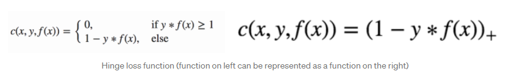

# Conceito (O que é? Pra que serve?)

Support Vector Machine, ou Máquina de suporte vetorial ou ainda apenas SVM, foi elaborado com o estudo proposto por Boser, Guyon e Vapnik em 1992. Se trata de um algorítmo de aprendizado de máquina supervisionado. É usado tanto em problemas de classificação quanto de regressão.

Consiste em traçar hiperplanos com intuito de separar os dados que são mapeados num plano multidimensional, onde cada dimensão do plano representa um parâmetro. Devido a isto, seus parâmetro precisam ser valores numéricos.

O plano é separado de modo que haja a maior margem possível entre a separação e o posicionamento dos dados.

Este algorítmo apesar de no começo parecer aplicável apenas em problemas lineares, pode também ser aplicado em problemas não lineares, devido a transformações que as funções Kernel fazem para ajustar os parâmetros para o modelo.

# Classes de Problemas com melhores resultados

Este algorítmo é usado para resolver problemas de classificação de dados e de regressão.

Uma vantagem é que ele performa bem quando a quantidade de dimensões é maior do que a quantidade de dados usados no treinamento.

Basicamente esta técnica é bem eficaz para vários tipos de problemas, não tendo uma classe de problemas específica para ser utilizado.

# Definição Teórica e Modelagem Matemática

Devido a alguns parâmetros de uma classe estarem sobrepostos com os parâmetros de outras classes, utiliza-se do artifício de reposicionar estes dados para posteriormente encontrar a fronteira que melhor separa os parâmetros de cada classe. Este reposicionamento se dá pelas funções `Kernel`, que pode ser escolhida conforme o problema a ser resolvido.

O objetivo por trás do algorítmo é achar um hiperplano com o máximo de margem entre os parâmetros de cada classe mais próximos, chamados de vetores de suporte. Não deve existir nenhum parâmetro dentro da margem, e o intuito dela ser maximizada é para conseguir uma boa generalização quando dados não conhecidos vierem a ser preditados pelo modelo.

Para maximizar a margem, podemos utilizar a função *hinge loss*:



Esta função será utilizada em conjunto com o grandiente descendente para encontrar os pesos `w` que criará o hiperplano com o máximo de margem.

# Vantagens e Desvantagens (limitações)

Vantagens:

- É efetivo em muitas dimensões
- Continue efetivo quando o número de parâmetros (dimensões) é maior que a quantidade de amostras
- Usa o subconjunto de treinamento nas decisões, então é eficiente em termo de memória
- É versátil, pois diferentes tipos de funções Kernel podem ser usadas.

Desvantagens:

- Depende que os dados estejam espacialmente separados, portanto classes diferentes não podem ter seus parâmetros muito sobrepostos.
- Devido as transformações de Kernel serem complexas, o processo é difícil de ser interpretado em comparação com outros modelos como a árvore de decisões ou KNN.
- No caso de outlier, quando um dado que é classificado errado devido a posição dos parâmetros, este dado é ignorado do treinamento.

# Exemplo de uma aplicação em Python

```python
import pandas as pd
from sklearn.utils import shuffle
from sklearn.model_selection import train_test_split
from sklearn.metrics import accuracy_score
import numpy as np


class SVM:
    def __init__(self, learning_rate=0.001, lambda_param=0.01, n_iters=1000):
        self.lr = learning_rate
        self.lambda_param = lambda_param
        self.n_iters = n_iters
        self.w = None
        self.b = None

    def fit(self, X, y):
        _, n_features = X.shape

        y_ = np.where(y <= 0, -1, 1)

        self.w = np.zeros(n_features)
        self.b = 0

        for _ in range(self.n_iters):
            for idx, x_i in enumerate(X):
                condition = y_[idx] * (np.dot(x_i, self.w) - self.b) >= 1
                if condition:
                    self.w -= self.lr * (2 * self.lambda_param * self.w)
                else:
                    self.w -= self.lr * (
                        2 * self.lambda_param * self.w -
                        np.dot(x_i, y_[idx] if len(y_[idx])
                               > 1 else y_[idx].item())
                    )
                    self.b -= self.lr * y_[idx]

    def predict(self, X):
        approx = np.dot(X, self.w) - self.b
        return np.sign(approx)


df = pd.read_csv('./database-svm/iris.csv')
df = df.drop(['Id', 'SepalWidthCm', 'PetalWidthCm'], axis=1)
target = df['Species']
rows = list(range(100, 150))
df = df.drop(df.index[rows])

Y = []
for val in target[0:100]:
    if(val == 'Iris-setosa'):
        Y.append(-1)
    else:
        Y.append(1)
df = df.drop(['Species'], axis=1)
X = df.values.tolist()
# Shuffle and split the data into training and test set
X, Y = shuffle(X, Y)
x_train = []
y_train = []
x_test = []
y_test = []

x_train, x_test, y_train, y_test = train_test_split(X, Y, train_size=0.9)

x_train = np.array(x_train)
y_train = np.array(y_train)
x_test = np.array(x_test)
y_test = np.array(y_test)

y_train = y_train.reshape(90, 1)
y_test = y_test.reshape(10, 1)

clf = SVM()
clf.fit(x_train, y_train)

print(clf.w, clf.b)

predictions = clf.predict(x_test)
print(accuracy_score(y_test, predictions))
```